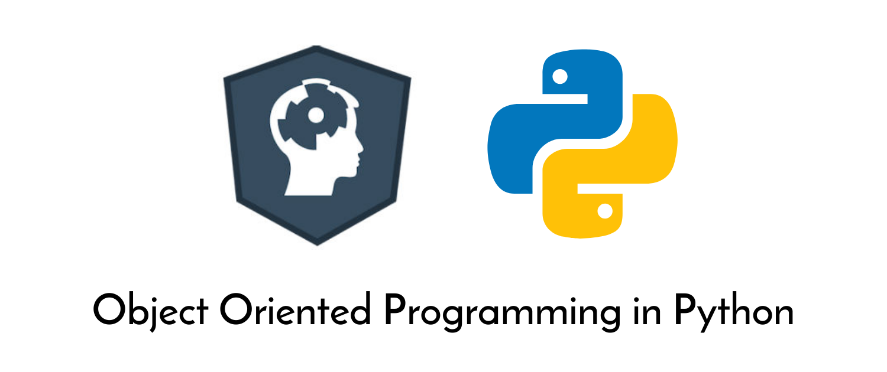

# OOP Python DataCamp

A course offered by DataCamp & taugh by @alexyarosh . In this course, I've taken notes on standard approaches for class design, inheritance, polymorphism, encapsulation and other OOP fetures as a part of my researchwork. Notes on OOP covered in this course are listed below.

- [Fundamentals](I-%20fundamentals/README.md)
- [Inheritance & Polymorphism](II-%20inheritance%20%26%20polymorphism/README.md)
- [Standard Python](III-%20standard%20python)
